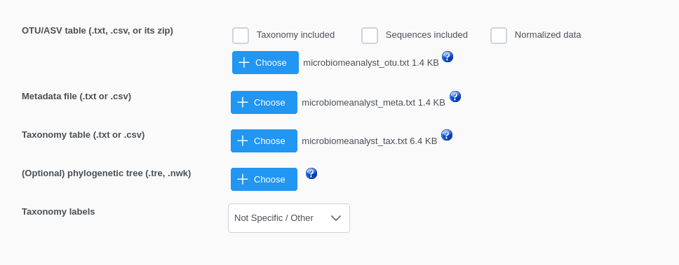

# MetagenomicsDB
MetagenomicsDB is a data management system for microbial case-control studies. It allows all researchers, regardless of their
programming knowledge, to safely store, explore, and export their study results for statistical analyses. It was developed
for an ongoing prospective study of the gut microbiome of children who are small for their gestational age.

## Visual example
MetagenomicsDB is intended to be used as the backend for a graphical web interface. We showcase the potential of this approach
by making our [custom web interface](https://www.bioinformatics.uni-muenster.de/tools/metagenomicsDB) for our SGA study publicly
accessible. User requirements regarding included features, data security policies, and web environments are different. Thus, we
provide this visual example as a baseline for users to implement their own custom systems.

## Installation
This installation guide was tested on a freshly installed Debian 12.8 64-bit system. During installation, XFCE 4.18 and
"standard system utilities" were selected. In the following, code lines prefixed by "#" are meant to be run as root.
All comands should be run in the bash shell.

### Setting up the database
We tested MetagenomicsDB with PostgreSQL 14beta2 and PostgreSQL 15.10. Please make sure that you run one of these versions.
If you don't have PostgreSQL installed yet, install it from the official repositories.

`# apt install postgresql`

You also need a driver for Perl and the plperl extension for PostgreSQL.

`# apt install libdbd-pg-perl postgresql-plperl`

Now, confirm that PostgreSQL is running and setup a login as non-root with a password of your choice (here: "postgres"). 
<code>
\# service postgresql status 
\# su postgres 
psql -c 'ALTER USER postgres PASSWORD $$postgres$$';
</code> 
Exit psql and login as the regular user with whom you want to use MetagenomicsDB. Create a
[".pg_service.conf"](https://www.postgresql.org/docs/current/libpq-pgservice.html) file in the user's home directory. The file is used
by MetagenomicsDB to find the test and production databases. If you installed PostgreSQL locally, the file could look like this. 
<code>
[debug] 
host=localhost 
dbname=debug 
user=postgres 
password=postgres 
 
[metagdb] 
host=localhost 
dbname=metagenomicsdb 
user=postgres 
password=postgres 
</code>

Next, please login as the postgres user and create the test (debug) and the production (metagdb) databases. If you use an existing
installation of PostgreSQL, please make sure that these databases ("dbname" in previous file) are not already in use. 

<code>
su - -c 'su postgres' 
psql -c 'CREATE DATABASE debug WITH LC_COLLATE = $$C.UTF-8$$ TEMPLATE = template0' 
psql -c 'CREATE DATABASE metagenomicsDB WITH LC_COLLATE = $$C.UTF-8$$ TEMPLATE = template0' 
</code>

You can now exit psql. In order to change the error messages to English which is a requirement, please make sure your
PostgreSQL configuration file contains the line "lc_messages = 'C.UTF-8'". You can find the file here: 

`# find / -name postgresql.conf`

### Dependencies

#### External programs
MetagenomicsDB depends on TaxonKit v0.19.0. At the time of writing, this version was not officially released, but can be
accessed from the [issue section](https://github.com/user-attachments/files/17740852/taxonkit_linux_amd64.tar.gz) on its
official GitHub page. Extract the archive and add the resulting file to the PATH (e.g.: place it in "/usr/local/bin/").

#### Perl
On Debian 12.8, Perl v5.36.0 is preinstalled. If this should not be the case for you, please install it. Some Perl modules are
best installed via apt. 

`# apt install libperlio-gzip-perl libparams-validationcompiler-perl libmodule-pluggable-perl`

The rest can be installed via cpanm. Please ignore the first line, if cpanm is already installed on your system. 
<code>
\# cpan App::cpanminus 
\# perlModules=( \ 
&nbsp;&nbsp;"Archive::Extract" \ 
&nbsp;&nbsp;"Archive::Zip" \ 
&nbsp;&nbsp;"DBI" \ 
&nbsp;&nbsp;"DateTime::Duration" \ 
&nbsp;&nbsp;"DateTime::Format::ISO8601" \ 
&nbsp;&nbsp;"Encode" \ 
&nbsp;&nbsp;"File::Type" \ 
&nbsp;&nbsp;"Git::Version::Compare" \ 
&nbsp;&nbsp;"IO::Handle" \ 
&nbsp;&nbsp;"IO::Scalar" \ 
&nbsp;&nbsp;"IO::Uncompress::AnyUncompress" \ 
&nbsp;&nbsp;"Spreadsheet::Read" \ 
&nbsp;&nbsp;"Spreadsheet::ParseExcel" \ 
&nbsp;&nbsp;"Spreadsheet::ParseODS" \ 
&nbsp;&nbsp;"Spreadsheet::ParseXLSX" \ 
&nbsp;&nbsp;"Text::CSV_XS" \ 
&nbsp;&nbsp;"Test2::Bundle::More" \ 
&nbsp;&nbsp;"Try::Tiny" \ 
); \ 
\# for module in ${perlModules[@]}; do
        cpanm ${module} 2>/dev/null || { printf "ERROR: Could not install ${module}"; exit 1; }; done
</code>

### MetagenomicsDB
Download and extract the code from this repository and move it to a directory of your choice. Make all Perl
files in the directory executable. 

`find -type f -name '*.pl' -exec chmod 550 {} \;`

## Testing
To verify the installation, please run all "test_*.pl" scripts in "bin/tests" and examine the output. Failed test
are prefixed by "[not ok]" with some debugging information. If you cannot get to the bottom of the issue, don't
hesitate to open an issue in this repository. If the test scripts crash or you have to abort them manually,
you may need to drop and re-create the debug database to remove residual data.

## Populating the database with example data
The "install/testdata" directory contains <b>artificial example data</b> which you can use to explore the
system. The Supplementary Methods of our publication describe, how the data was created. Two data sets are
available. In one set, sequences were analyzed by the [MetaG classifier](https://doi.org/10.1101/2020.03.13.991190).
In the other, sequences were analyzed by [Kraken 2](https://doi.org/10.1186/s13059-019-1891-0).
Please decide on one of the data sets. Before you can continue, you need to create the relations, views, and
functions in the production database using the provided schema. 

`psql service=metagdb < www-intern/db/schema.sql`

Now insert the files with the test data using either 
<code>
./bin/importSGA.pl \ 
&nbsp;&nbsp;--table install/testdata/TestdataMeasurements_MetaG.ods \ 
&nbsp;&nbsp;--data install/testdata/data \ 
&nbsp;&nbsp;--format ods \ 
&nbsp;&nbsp;--whogirls install/testdata/data/wfa-girls-zscore-expanded-tables.xlsx \ 
&nbsp;&nbsp;--whoboys install/testdata/data/wfa-boys-zscore-expanded-tables.xlsx \ 
&nbsp;&nbsp;--verbose
</code> 
for MetaG or 
<code>
./bin/importSGA.pl \ 
&nbsp;&nbsp;--table install/testdata/TestdataMeasurements_Kraken2.ods \ 
&nbsp;&nbsp;--data install/testdata/data \ 
&nbsp;&nbsp;--taxonomy install/testdata/data/taxonomy/kraken2/rdp/taxonomy \ 
&nbsp;&nbsp;--format ods \ 
&nbsp;&nbsp;--whogirls install/testdata/data/wfa-girls-zscore-expanded-tables.xlsx \ 
&nbsp;&nbsp;--whoboys install/testdata/data/wfa-boys-zscore-expanded-tables.xlsx \ 
&nbsp;&nbsp;--verbose
</code> 
for Kraken 2.

## Exporting the example data to MicrobiomeAnalyst
For the purpose of this example, all samples shall be exported from the database to
[MicrobiomeAnalyst](https://doi.org/10.1093/nar/gkad407). The export script requires to specify
a list of id numbers. Here, however, an in-line psql statement is used to avoid having to
type all id number manually. 
<code>
./bin/exportSGA.pl \ 
&nbsp;&nbsp;--format microbiomeanalyst \ 
&nbsp;&nbsp;--ids $(psql service=metagdb -t -c 'SELECT string_agg(id::text, $$,$$::text) FROM sample') \ 
&nbsp;&nbsp;> ../microbiomeanalyst.zip
</code> 
Extract the archive and upload the files to the
[Marker Data Profiling](https://www.microbiomeanalyst.ca/MicrobiomeAnalyst/upload/OtuUploadView.xhtml)
workflow in MicrobiomeAnalyst as shown here. Please note the setting for "Taxonomy labels."

## Further steps
Typically, you may wish to create a custom web interface. For this, please have a look at our visual
example mentioned before. Consult our publication including the Supplementary Methods (see below) for a
detailed description of the underlying rational. In order to customize the functionality of MetagenomicsDB,
please read the descriptions in the publication and the Supplementary Methods. The aforementioned tests
will assist you in the software development, as they will readily show, if some basic functional got lost by
your adjustments. If you think that your changes are useful for a wider audience, please open a pull request.

## Publication
For further information, refer to our [manuscript](https://doi.org/10.1101/2024.06.11.598475).
Please cite the manuscript or the URL to this repository, if you use MetagenomicsDB in your research.

## Copyright
The files "whoboys.xlsx" and "whogirls.xlsx" in "bin/tests/data/spreadsheets/" and the files
"wfa-boys-zscore-expanded-tables.xlsx" and "wfa-girls-zscore-expanded-tables.xlsx" in
"install/testdata/data/" were obtained from the website of the World Health Organization (WHO):
* https://cdn.who.int/media/docs/default-source/child-growth/child-growth-standards/indicators/weight-for-age/expanded-tables/wfa-boys-zscore-expanded-tables.xlsx
* https://cdn.who.int/media/docs/default-source/child-growth/child-growth-standards/indicators/weight-for-age/expanded-tables/wfa-girls-zscore-expanded-tables.xlsx

The Kraken 2 taxonomy files "names.dmp" and "nodes.dmp" in
"install/testdata/data/taxonomy/kraken2/rdp/taxonomy" were created with kraken2-build
version 2.1.3 based on unaligned sequence FASTA files for bacteria, archaea, and fungi from
[RDP version 11.5](https://rdp.cme.msu.edu/misc/resources.jsp) on 2021/11/24. 

For the remaining files, unless stated otherwise, the following copyright agreement applies: 

Redistribution and use in source and binary forms, with or without modification,
are permitted provided that the following conditions are met:

1. Redistributions of source code must retain the above copyright
 notice, this list of conditions and the following disclaimer.

2. Redistributions in binary form must reproduce the above copyright
 notice, this list of conditions and the following disclaimer in the
 documentation and/or other materials provided with the distribution.

THIS SOFTWARE IS PROVIDED BY THE AUTHOR AS IS AND ANY EXPRESS OR IMPLIED WARRANTIES,
INCLUDING, BUT NOT LIMITED TO, THE IMPLIED WARRANTIES OF MERCHANTABILITY AND FITNESS
FOR A PARTICULAR PURPOSE ARE DISCLAIMED. IN NO EVENT SHALL THE AUTHOR BE LIABLE FOR
ANY DIRECT, INDIRECT, INCIDENTAL, SPECIAL, EXEMPLARY, OR CONSEQUENTIAL DAMAGES
(INCLUDING, BUT NOT LIMITED TO,  PROCUREMENT  OF  SUBSTITUTE GOODS  OR  SERVICES;
LOSS  OF USE, DATA, OR PROFITS; OR BUSINESS INTERRUPTION) HOWEVER CAUSED AND ON ANY
THEORY OF LIABILITY, WHETHER IN CONTRACT, STRICT LIABILITY, OR TORT (INCLUDING NEGLIGENCE
OR OTHERWISE) ARISING IN ANY WAY OUT OF THE USE OF THIS SOFTWARE, EVEN IF ADVISED OF THE
POSSIBILITY OF SUCH DAMAGE. 
